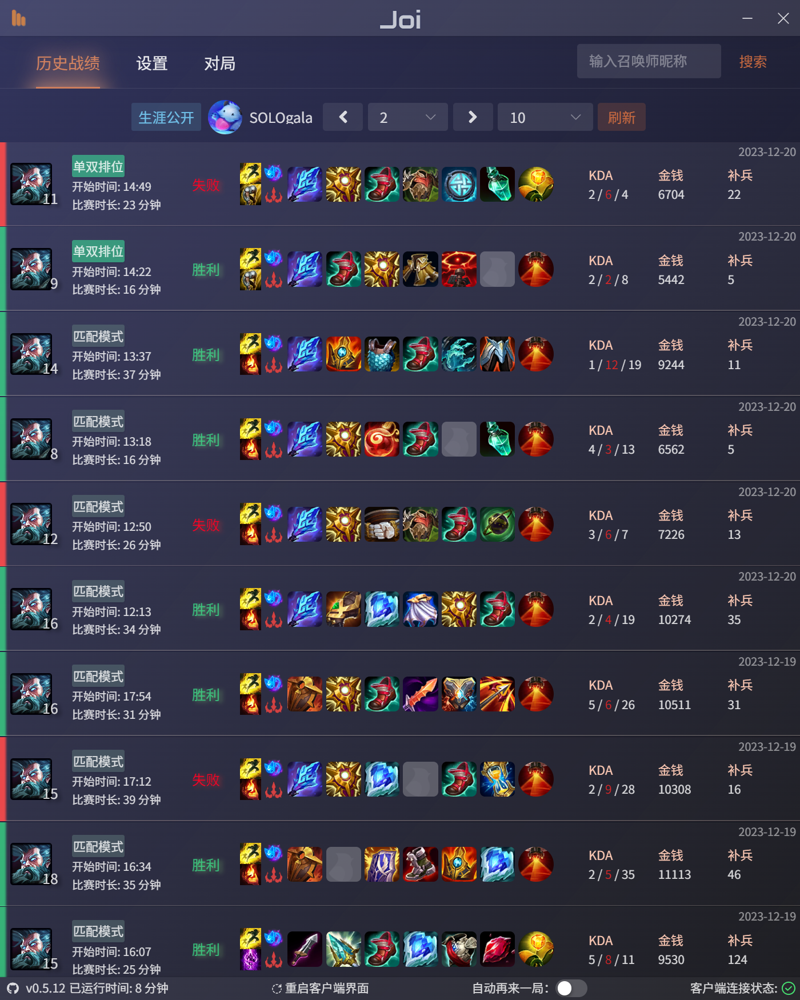
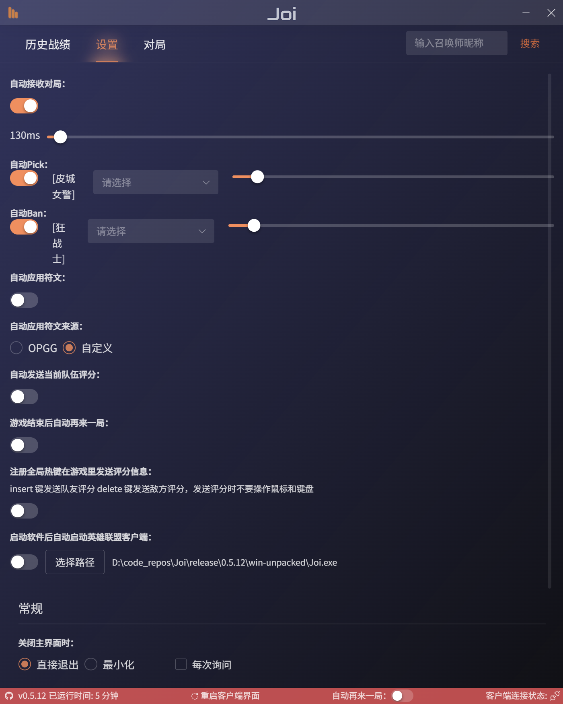

# Joi

另一个英雄联盟助手工具 
🍴 from [watchingfun/Joi](https://github.com/watchingfun/Joi)

## 目前功能：

- [x] 自动接受对局
- [x] 自动（延时）BanPick 
- [x] 重启客户端界面进程功能
- [x] 个人战绩查询
- [x] sqlite3存储配置项
- [x] 战绩详情查询
- [x] 他人战绩查询
- [x] 设置项配置功能
- [x] 对局分析
- [x] 自动检测大乱斗胜率队
- [x] 应用检查更新功能

## TODO:
- [ ] 小黑屋功能
- [ ] 大乱斗自动抢英雄

## 截图


<!--  -->


## 编译步骤

### 所需环境

- Node v18
- Python 3.9
- Visual Studio 2022 (Visual C++ Build Tools) 安装工作负载 使用C++的桌面开发

npmrc 添加配置项

```
#npm镜像
registry=https://registry.npmmirror.com/

#electron下载镜像
electron-mirror=https://npmmirror.com/mirrors/electron/

#msbuild路径,需要改成自己vs安装位置
msbuild_path=F:\Program Files\Microsoft Visual Studio\2022\Community\MSBuild\Current\Bin\MSBuild.exe

#vs版本
msvs_version=2022
```

### 步骤

安装依赖

```
npm install
```

编译原生模块

```
npm run rebuild
```

打包

```
npm run build
```

## 参考资料

- https://hextechdocs.dev/getting-started-with-the-lcu-api/
- https://www.mingweisamuel.com/lcu-schema/tool/#
- https://github.com/XHXIAIEIN/LeagueCustomLobby
- https://github.com/real-web-world/hh-lol-prophet
- https://github.com/XilyFeAAAA/RIVEN
- https://github.com/electron-vite/electron-vite-vue
